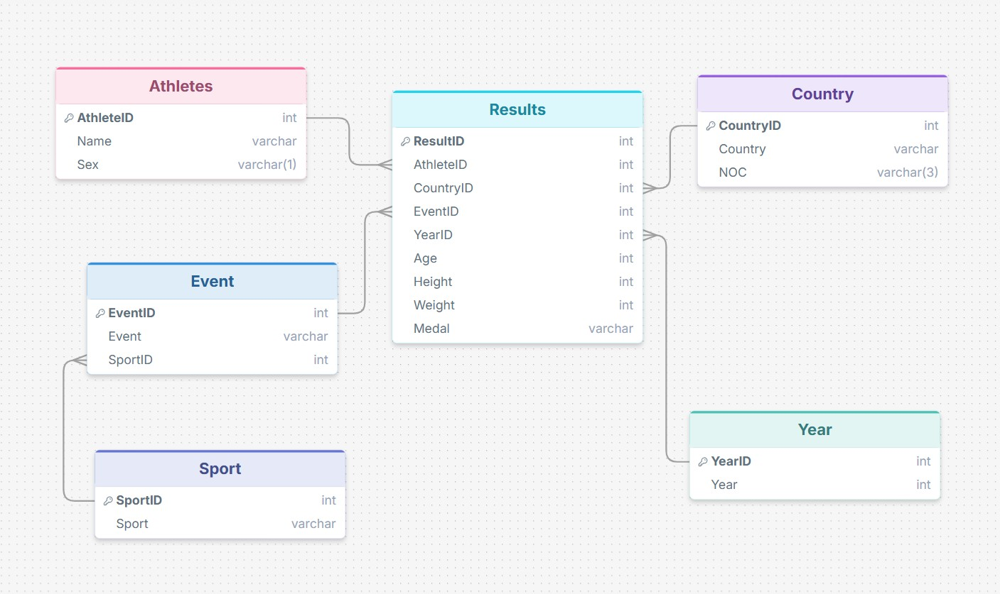

# Olympic Athlete Analysis
Business Intelligence case study analyzing Olympic athlete profiles using PostgreSQL, SQL and Power BI.

## Project Overview
This project analyzes Olympic athlete data to identify patterns in age, height and weight across different sports and genders.
The analysis was conducted as a Business Intelligence case study for SportsStats, a fictional company working with sports journalists and elite trainers. The goal was to uncover sport-specific athlete profiles and long-term trends that could support performance analysis and athlete development.
The project covers the complete BI workflow, including data modeling, database design, SQL analysis and Power BI dashboard development.

## Business Context
SportsStats collaborates with local news agencies and elite personal trainers to generate insights from major sporting events.
The objective of this project was to analyze Olympic athlete data to identify meaningful patterns and trends that could either support sports-related storytelling or provide valuable information for athlete development and performance optimization.
By examining athlete age, height and weight across sports and genders, the analysis aims to improve the understanding of sport-specific athlete profiles and long-term developments in elite sports.

## Research Questions

### 1. At what age do athletes typically compete in each Olympic sport?
The analysis examines average athlete age across sports and compares differences between male and female athletes.
  
### 2. What physical characteristics are typical for different sports?
This question focuses on athlete height and weight profiles across sports, again distinguishing between male and female athletes.
  
### 3. How have Olympic athletes changed over time?
The analysis investigates whether athlete age, height and weight have changed over the decades and whether these developments differ between men and women.

## Dataset
The analysis is based on a historical Olympic Games dataset containing athlete participation records across multiple decades.
The original dataset included athlete demographics, physical characteristics, sports and event information, as well as participation details such as year and country representation.

Key attributes included:
- Athlete ID
- Name
- Gender
- Age
- Height
- Weight
- Country (NOC)
- Year
- Sport
- Event
- Medal

To support efficient analysis, the original flat dataset was normalized into a relational database model and imported into PostgreSQL.

## Data Model

The original dataset was transformed into a normalized relational database model to improve data consistency and support efficient analytical queries.

The final database structure consists of the following entities:

- Athletes
- Sport
- Events
- Country
- Years
- Results

The model was implemented in PostgreSQL using primary keys, foreign keys and a dedicated medal ENUM type.

### Entity Relationship Diagram

## Tools & Technologies

- PostgreSQL
- SQL
- Power BI
- Power Query
- Data Modeling
- Database Normalization
- Data Visualization

## Dashboard Overview

The Power BI dashboard was designed to answer the three main research questions through dedicated analysis pages:
  ### Age Analysis
  Analysis of average athlete age across sports and genders.
  ### Body Profiles
  Comparison of average height and weight profiles across sports and genders.
  ### Decade Trends
  Long-term analysis of age, height and weight developments across decades.

## Key Findings

- Athlete age varies significantly across sports. Sports such as Gymnastics and Swimming are generally characterized by younger athletes, while sports such as Equestrianism and Archery tend to have higher average ages.

- Male and female athletes often compete at different stages of their athletic careers. In several sports, female athletes participate at younger average ages than their male counterparts.

- Distinct sport-specific body profiles were identified. Sports such as Basketball, Volleyball and Rowing are associated with taller and heavier athletes, while other disciplines show considerably smaller average body measurements.

- Long-term trend analysis revealed that athletes in several sports have become taller and heavier over the decades, although these developments vary considerably between sports.

- Historical factors, including world wars and the later introduction of women to certain Olympic disciplines, influence the interpretation of long-term trends and should be considered when comparing results across time periods.

## Recommendations

- Training and talent development programs should be tailored to sport-specific athlete profiles rather than relying on generalized assumptions.

- Age, height and weight benchmarks can support athlete development by providing realistic reference values for different sports and genders.

- Long-term changes in athlete profiles should be monitored continuously to adapt training concepts to evolving physical demands in elite sports.

- Historical and contextual factors should be considered when interpreting athlete development trends, especially when comparing male and female participation across different time periods.

## Repository Structure

Repository structure will be documented after all project files have been uploaded.
